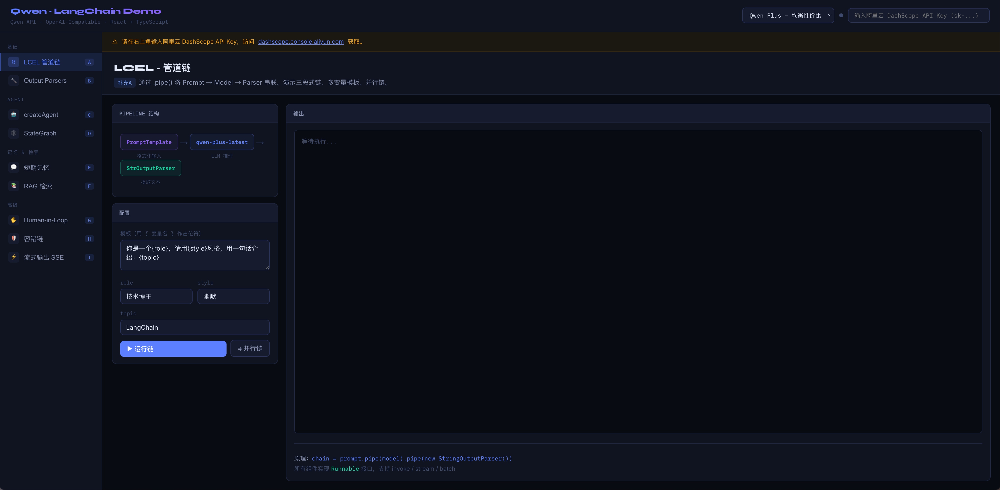
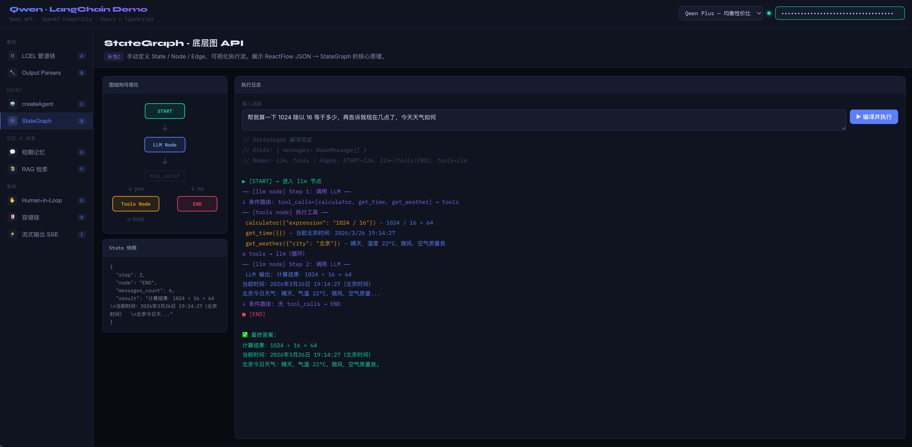

# Qwen · LangChain 知识点演示台

基于阿里云千问（Qwen）API 的 LangChain 核心知识点交互演示项目。

单端口运行的真实工程骨架：

- 前端：React + TypeScript + Vite
- 后端：Express + TypeScript
- 模型调用：服务端持有 `QWEN_API_KEY`
- LangChain：`LCEL` 与 `Output Parsers` 已改为服务端真实执行
- 兼容迁移：其余面板先通过服务端代理 DashScope，避免浏览器暴露密钥
- 开发体验：前端自动刷新，服务端代码修改自动重启
- 会话存储：`MemoryPanel` 的会话与消息会持久化到本地 JSON 文件

开发态行为：

- 修改 `src/` 下前端代码：页面通过 Vite HMR 自动刷新
- 修改 `server/` 或 `.env`：Node 进程自动重启

## 项目示例图




## 技术栈

- **React 18** + **TypeScript**
- **Vite 5** 构建工具
- **Express** 服务端
- **LangChain** 运行时
- **Qwen API**（兼容 OpenAI 接口）

## 快速启动

```bash
# 安装依赖
pnpm install

# 配置服务端环境变量
cp .env.example .env

# 启动项目（前后端同端口）
pnpm dev

# 打包
pnpm build

# eslint 检测
pnpm eslint
```

## 访问

```bash
http://localhost:5173
```

## 会话存储

服务端会将 MemoryPanel 的会话数据写入本地 `data/sessions.json`。该目录已加入 `.gitignore`，默认不提交到仓库。

## 配置 API Key

访问 [阿里云 DashScope 控制台](https://dashscope.console.aliyun.com/apiKey) 获取 API Key，并写入 `.env`：

```bash
QWEN_API_KEY=your_dashscope_api_key
QWEN_BASE_URL=https://dashscope.aliyuncs.com/compatible-mode/v1
PORT=5173
```

前端不再直接保存或发送 API Key。

## 演示模块

| 模块               | 知识点    | 说明                                |
| ------------------ | --------- | ----------------------------------- |
| A · LCEL 管道链    | 补充A     | `.pipe()` 串联、多变量模板、并行链  |
| B · Output Parsers | 补充B     | String / JSON / List 三种解析器对比 |
| C · createAgent    | 阶段一/二 | ReAct 循环可视化，4 个模拟工具      |
| D · StateGraph     | 补充C     | 底层图构建，节点/边动态高亮         |
| E · 短期记忆       | 阶段二    | thread_id 多会话隔离，真实多轮对话  |
| F · RAG 检索       | 阶段三    | 相似度搜索，有/无 RAG 效果对比      |
| G · Human-in-Loop  | 阶段三    | 高风险工具暂停审批流程              |
| H · 容错链         | 补充E     | 多级备用模型，模拟限流场景          |
| I · 流式输出       | 阶段二    | SSE 打字机效果，三种 streamMode     |

## Qwen API 说明

Qwen API 完全兼容 OpenAI Chat Completions 格式：

```
Base URL: https://dashscope.aliyuncs.com/compatible-mode/v1
模型列表: qwen-max-latest / qwen-plus-latest / qwen-turbo-latest / qwen-long
```

## 项目结构

```
server/
├── index.ts                 # Express API + LangChain runtime
├── lib/
│   ├── runtime.ts           # 服务端运行时配置与模型工厂
│   └── session-store.ts     # 本地 JSON 会话存储
├── routes/
│   ├── api.ts               # API 路由汇总
│   ├── chat.ts              # Chat / SSE 代理路由
│   ├── health.ts            # 健康检查路由
│   ├── langchain.ts         # LangChain 相关路由
│   ├── sessions.ts          # 会话存储与回复路由
│   ├── chat/
│   └── langchain/
src/
├── lib/
│   ├── qwen.ts               # 前端 API 客户端（调用本地 /api）
│   ├── tools.ts              # 工具定义与模拟执行器
│   └── rag.ts                # RAG 知识库与相似度检索
├── hooks/
│   └── useQwen.ts            # 统一 API 调用 Hook
├── components/
│   ├── ui.tsx                # 通用 UI 组件库
│   ├── LCELPanel.tsx         # LCEL 管道链
│   ├── ParsersPanel.tsx      # Output Parsers
│   ├── AgentPanel.tsx        # createAgent
│   ├── StateGraphPanel.tsx   # StateGraph
│   ├── MemoryPanel.tsx       # 短期记忆
│   ├── RAGPanel.tsx          # RAG检索
│   ├── HITLPanel.tsx         # Human-in-Loop
│   ├── FallbackPanel.tsx     #  执行容错链
│   └── StreamPanel.tsx       # 流式输出 SSE
├── public/
│   ├── demo1.png             # 演示图1
│   └── demo2.png             # 演示图2
├── .env.example              # 服务端环境变量模板
├── .gitignore                # Git 忽略配置文件
├── index.html                # HTML 入口文件
├── package.json              # 项目依赖与脚本
├── pnpm-lock.yaml            # pnpm 依赖锁定文件
├── tsconfig.server.json      # 后端 TypeScript 配置
├── tsconfig.json             # TypeScript 配置文件
├── vite.config.ts            # Vite 构建配置文件
└── App.tsx                   # 主布局 + 导航
```
